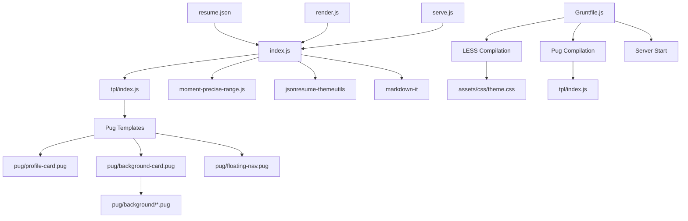
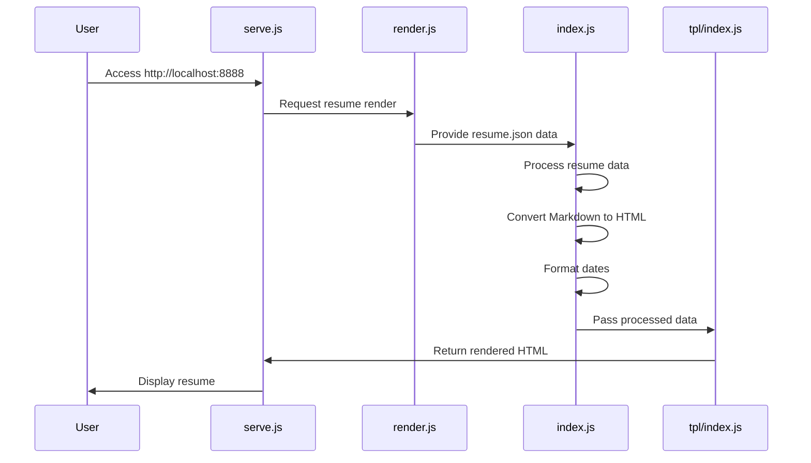
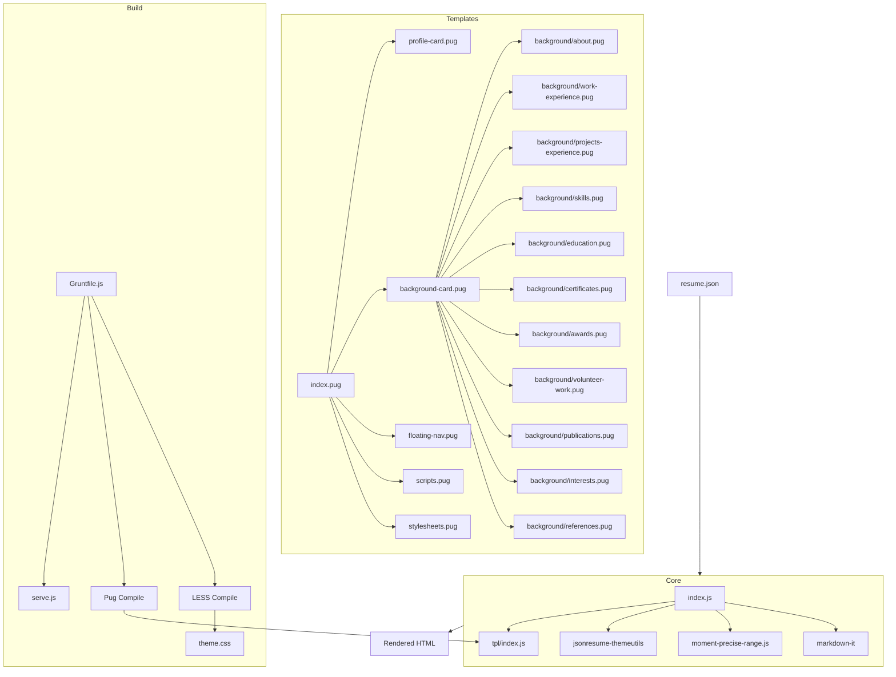
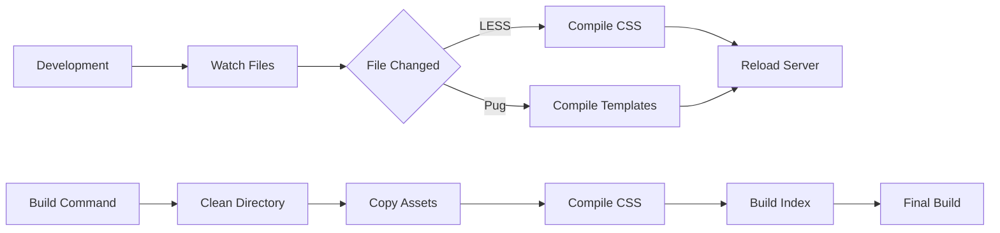

# JSON Resume Elegant Theme - Project Structure

This document provides a comprehensive overview of the `jsonresume-theme-elegant` project structure, components, and workflow.

## Overview

The Elegant Theme is a responsive theme for [JSONResume](https://jsonresume.org/) that uses a card-based layout. It supports markdown in various resume sections and offers extensive social profile integration.

## Project Structure

```
jsonresume-theme-elegant/
├── .gitignore                # Git ignore file
├── Gruntfile.js              # Grunt task configuration
├── README.md                 # Project documentation
├── assets/                   # Theme assets
│   ├── css/                  # Compiled CSS
│   │   └── theme.css
│   └── less/                 # LESS source files
│       └── theme.less
├── build/                    # Build output directory
├── index.js                  # Main theme rendering logic
├── index.pug                 # Main Pug template
├── moment-precise-range.js   # Date difference calculation utility
├── package.json              # Project dependencies
├── pug/                      # Pug template components
│   ├── background/           # Background section templates
│   │   ├── about.pug
│   │   ├── awards.pug
│   │   ├── certificates.pug
│   │   ├── education.pug
│   │   ├── interests.pug
│   │   ├── projects-experience.pug
│   │   ├── publications.pug
│   │   ├── references.pug
│   │   ├── skills.pug
│   │   ├── volunteer-work.pug
│   │   └── work-experience.pug
│   ├── background-card.pug   # Background card wrapper
│   ├── floating-nav.pug      # Floating navigation component
│   ├── profile-card.pug      # Profile card component
│   ├── scripts.pug           # JavaScript scripts
│   └── stylesheets.pug       # CSS stylesheets
├── render.js                 # Resume rendering script
├── resume.json               # Example resume data
├── serve.js                  # Development server
└── tpl/                      # Compiled templates
    └── index.js              # Compiled Pug template
```

## Architecture Diagram



## Data Flow



## Component Relationships



## Build Process

The theme uses Grunt for automating the build process:

1. **LESS Compilation**: Converts LESS files to CSS
2. **Pug Compilation**: Compiles Pug templates to JavaScript functions
3. **Build**: Processes resume data and renders the final HTML
4. **Server**: Runs a development server for previewing the resume



## Key Components

### 1. Resume Data Processing

The `index.js` file contains the core logic for processing the resume data:

- Converting markdown to HTML
- Formatting dates
- Calculating durations
- Organizing skills with levels
- Structuring social profiles

### 2. Template Structure

The project uses Pug templates to generate HTML:

- **index.pug**: Main template structure
- **profile-card.pug**: Left sidebar with basic information
- **background-card.pug**: Main content area
- **floating-nav.pug**: Navigation menu

### 3. Responsive Design

The theme is fully responsive and includes:

- Floating navigation for desktop
- Collapsed navigation for mobile
- Card-based layout that adapts to screen size
- Bootstrap responsive grid

## Development Workflow

1. **Setup**:
   ```bash
   npm install -g grunt
   npm install -g pug-cli
   npm install
   ```

2. **Development**:
   ```bash
   grunt watch         # Watch for file changes
   grunt exec:run_server  # Run development server
   ```

3. **Build**:
   ```bash
   grunt build
   ```

## Project Extensions

The theme can be extended in several ways:

1. **Custom Styles**: Modify `assets/less/theme.less` to change the appearance
2. **New Sections**: Add new Pug templates in the `pug/background/` directory
3. **Additional Features**: Enhance `index.js` to process additional resume data
4. **Icon Support**: Add support for additional social profile icons

## Contributing Guidelines

When contributing to this project:

1. Create a feature branch from `master`
2. Follow the existing code style and naming conventions
3. Test changes locally using the development server
4. Submit a pull request with a clear description of changes